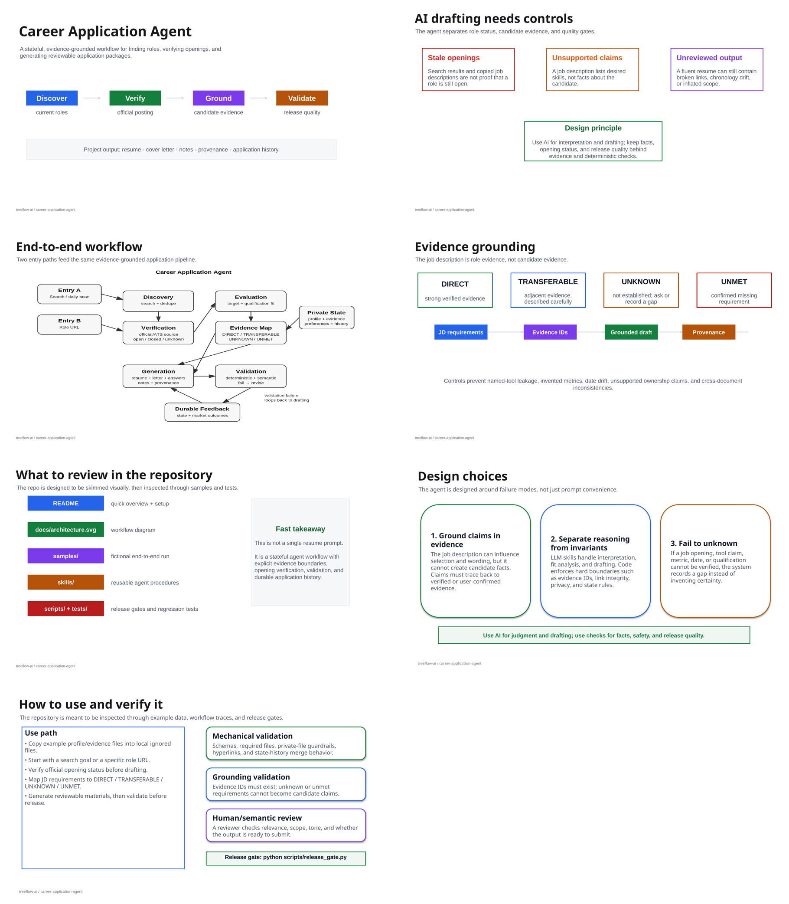
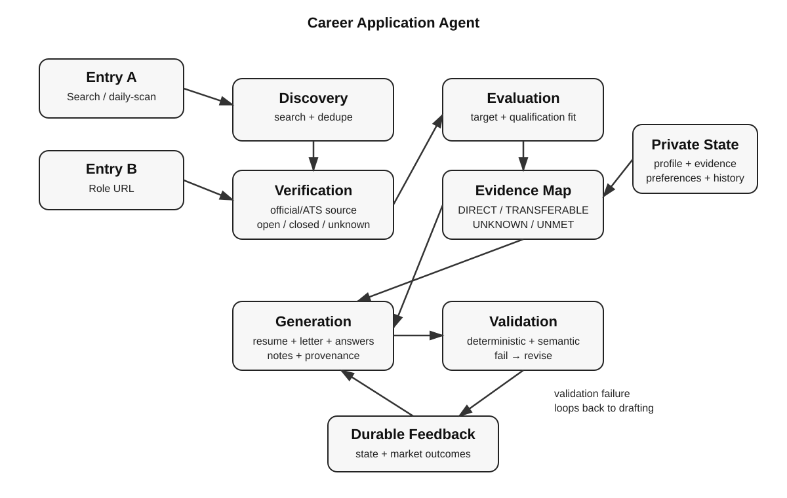

# Career Application Agent

A **stateful, evidence-grounded job-search and application agent** that discovers current roles, verifies that postings are still open, evaluates fit, maps requirements to candidate evidence, generates tailored application materials, validates them, and maintains durable application state.

The repository uses fictional example data. Your real identity, career history, preferences, and application history live in local files that are ignored by Git.

## Quick project overview

**What goes in:** your candidate profile/evidence plus either a job-search goal or a specific role URL.  
**What the agent does:** discovers or verifies the role, evaluates fit, builds an evidence map, generates application materials, validates factual/chronological/link integrity, and records state.  
**What comes out:** a reviewable resume, cover letter, application notes, provenance, and updated application history.

**Visual overview:** [view the slide deck](docs/Career-Application-Agent-Quick-Overview.pptx) · [open PDF version](docs/Career-Application-Agent-Quick-Overview.pdf) · [read the quick project overview](docs/QUICK-PROJECT-OVERVIEW.md)

[](docs/Career-Application-Agent-Quick-Overview.pdf)

For design rationale and common questions, see `docs/DESIGN-DECISIONS.md` and `docs/PROJECT-TALK-PREP.md`.



## What this agent does

```text
SEARCH / ROLE URL
      │
      ▼
Discover roles ──► Verify official posting is open/current
      │                         │
      └──────────────┬──────────┘
                     ▼
            Evaluate target + qualification fit
                     ▼
              Application preflight
                     ▼
              Evidence mapping
                     ▼
         Resume + cover letter + answers
                     ▼
   Deterministic QA + semantic/evidence review
                     ▼
          Reviewable application package
                     ▼
             Durable state / feedback
```

Two entry paths are supported:

1. **Discovery mode** — search current sources for relevant roles, deduplicate results, and verify candidate roles against an official employer/ATS source.
2. **Role mode** — start from a supplied posting URL, verify it, then evaluate and prepare application materials.

A search-engine result, aggregator card, stale cache, or copied JD is **not** enough to mark a role open. See `skills/job-verification.md`.

## Why this is an agent rather than one prompt

The repository separates:

- **orchestration** — `SKILL.md`
- **candidate facts/evidence** — `profile/`
- **policy** — `rules/`
- **reusable procedures** — `skills/`
- **durable state** — `state/`
- **deterministic plumbing/QA** — `scripts/`
- **regression tests** — `tests/`

The workflow has multiple stages, explicit handoffs, state transitions, failure/revision loops, and deterministic checks. Web/browser access is supplied by the host environment, keeping the package vendor-neutral.

## Evidence grounding

The job description is evidence about the **role**, not evidence about the **candidate**.

Candidate claims may be generated only from evidence marked `VERIFIED` or `USER_CONFIRMED`. Requirements are mapped as:

- `DIRECT` — strong verified evidence
- `TRANSFERABLE` — adjacent evidence; must be described as adjacent
- `UNKNOWN` — not established; ask or record a gap
- `UNMET` — confirmed missing requirement

Named tools, years of experience, scope, metrics, customers, titles, dates, work authorization, and management responsibility may not be inferred from the JD.

## Enhanced resume skill

The resume workflow includes more than keyword tailoring. See `docs/ENHANCED-RESUME-SKILL.md` for the full specification, including:

- requirement decomposition before drafting
- evidence-first tailoring
- chronology preservation
- customer-facing evidence preservation
- named-tool and metric discipline
- ATS-safe two-page evidence budgeting
- duplicate suppression
- project proof/link adjacency
- explicit `mailto:` / `https://` hyperlink integrity
- resume/cover-letter cross-artifact consistency
- deterministic QA plus semantic QA

## Repository map

```text
SKILL.md                     orchestrator / precedence / modes
profile/                     schemas and examples for candidate facts/preferences
rules/                       global policies
skills/                      focused procedures
docs/                        overview, architecture, rationale, and speaking guide
state/                       durable-memory schemas + fictional sample history
samples/                     fictional end-to-end demonstration
scripts/                     validators, state merge, offline posting checks
checks/                      release/privacy checklist
.gitignore                   keeps local personal data out of Git
.github/workflows/           CI release gate
```

## Set up your own data

Copy the examples locally:

```bash
cp profile/candidate.example.yaml profile/candidate.yaml
cp profile/preferences.example.yaml profile/preferences.yaml
cp profile/evidence.example.yaml profile/evidence-bank.yaml
cp profile/master-resume.example.md profile/master-resume.md
cp state/history.example.csv state/history.csv
```

Fill those local files with your own facts. They are ignored by Git. Keep the `.example.*` files fictional so the repository remains safe to share.

## Typical commands / intents

A host agent can expose these as commands, buttons, or natural-language intents:

- `daily-scan` — discover, dedupe, verify, screen, and shortlist current roles
- `role <URL>` — verify and analyze one role
- `prepare <URL>` — verify, preflight, evidence-map, and generate an application package
- `market-review` — analyze application outcomes without rewriting historical judgments
- `interview <role>` — create evidence-grounded interview preparation

## Opening verification contract

Before a role can be labeled `OPEN_VERIFIED`, the agent must find a current official employer or ATS source and record verification evidence. Redirect-to-home, 404, explicit “no longer accepting”, closed ATS states, or absence from the employer's current openings after reasonable re-checking must not be represented as open.

Verification is timestamped because openness is time-sensitive. The host may use web search/browser tools; `scripts/verify_posting_snapshot.py` provides deterministic checks for downloaded HTML/snapshots and test fixtures.

## Sample end-to-end run

See `samples/` for a fictional candidate and fictional employer flow:

`discovery results -> verified role -> evidence map -> resume -> cover letter -> application notes -> provenance -> history update`

The samples use fictional identities and `.example` domains.

## Validation

```bash
python scripts/validate_repo.py
python -m unittest discover -s tests -v
```

Or run the release gate:

```bash
python scripts/release_gate.py
```

CI runs the same gate on every push and pull request.

## Scope and boundaries

This project does **not** ship credentials, scrape behind authentication, auto-submit applications, infer sensitive self-identification, or claim that every ATS can be verified by a single HTTP heuristic. Final application submission remains a user action.
